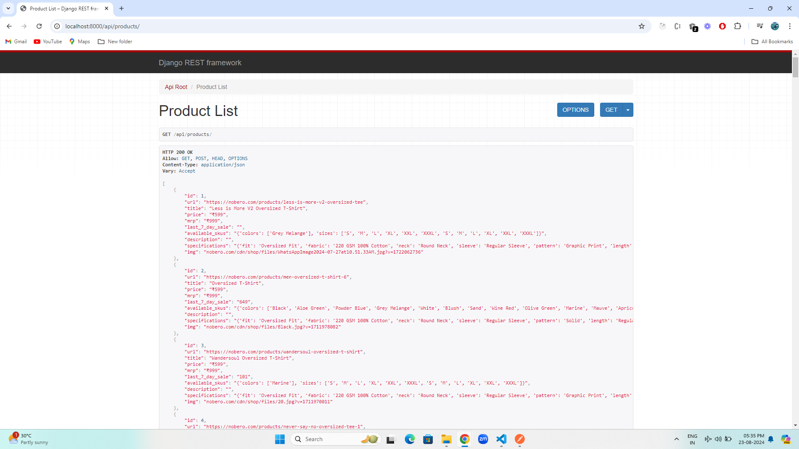
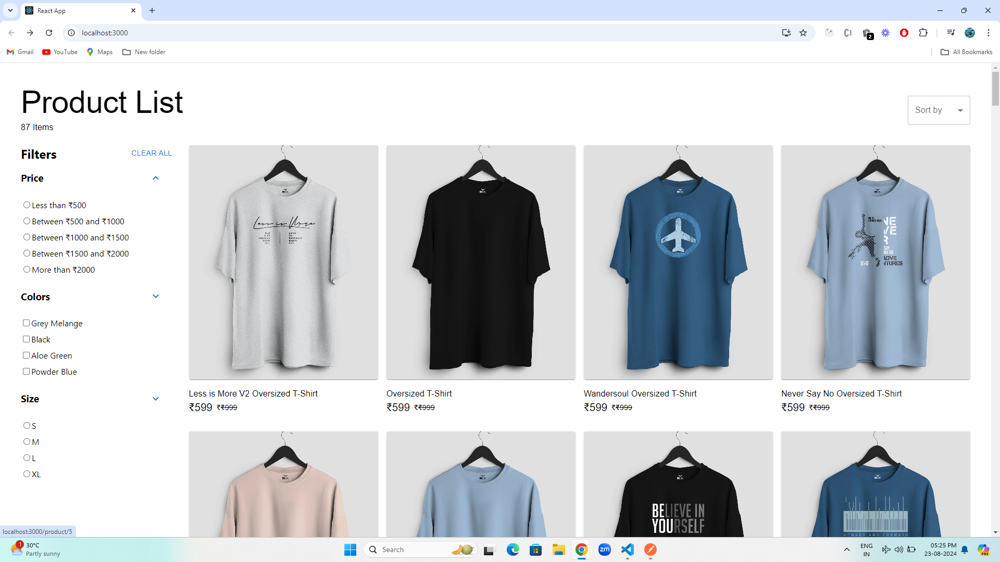
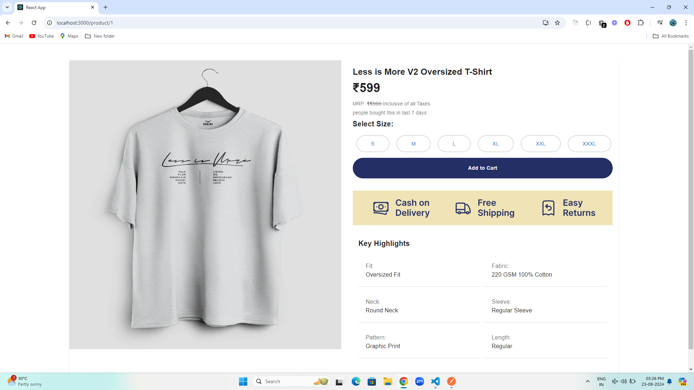

# Nobero Appilcation

## Backend Setup

The first thing to do is to clone the repository:

```sh
$ git clone https://github.com/naveen199201/nobero.git
$ cd nobero
```

Create a virtual environment to install dependencies in and activate it:

```sh
$ virtualenv2 --no-site-packages env
$ source env/bin/activate
```

Then install the dependencies:
a 
```sh
(env)$ pip install -r requirements.txt 
```
Note the `(env)` in front of the prompt. This indicates that this terminal
session operates in a virtual environment set up by `virtualenv2`.

Once `pip` has finished downloading the dependencies:
```sh
(env)$ python manage.py runserver
```

Open [http://localhost:8000](http://localhost:8000) to view it in your browser.

To view products
Open [http://localhost:8000](http://localhost:8000/api/products) to view it in your browser.


## Frontend Setup
First thing to do is to install the required node modules
```sh
$ cd nobero/e-commerce
$ npm install
```
Start the app by using the following command
```sh
$ npm start
```
Runs the app in the development mode.\
Open [http://localhost:3000](http://localhost:3000) to view it in your browser.


## Screenshot



Product Details page



## Scraping

To scrape the products from the website and save to Django database, you can use the following command

```sh
scrapy crawl men_page 
```

